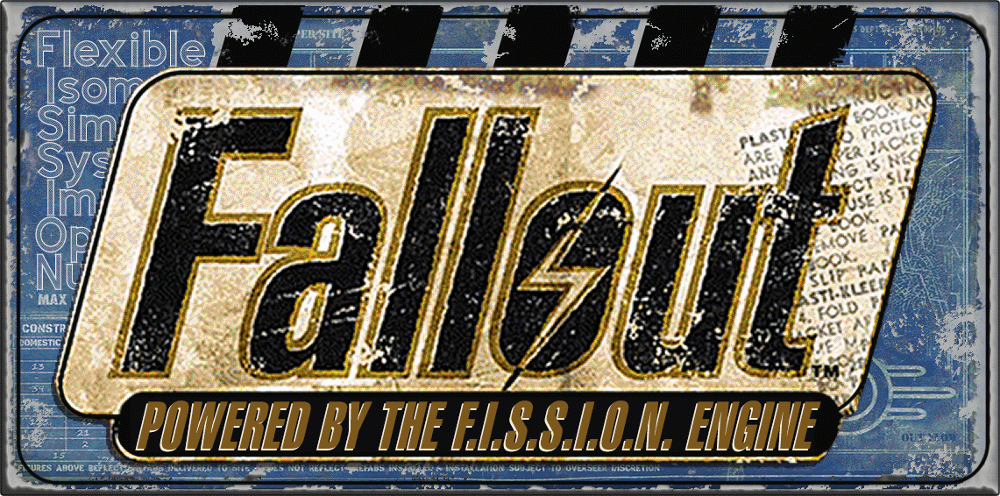

<p align="center">
  
</p>

# Fallout: F.I.S.S.I.O.N.
*Flexible Isometric Simulation System for Interactive Open‑world Nuclear‑roleplaying*

Fallout: F.I.S.S.I.O.N. is a next‑generation, cross‑platform reimplementation of Fallout 1 & 2 (Fallout2-CE) that preserves the original isometric, turn‑based gameplay while adding modern enhancements, widescreen support, and true community‑driven extensibility. Run it on Windows, Linux, macOS, Android, iOS—and even in browsers.

> ⚛️ **Powered by the F.I.S.S.I.O.N. Engine**
> *Flexible. Isometric. Simulation. System. Interactive. Open‑world. Nuclear‑roleplay.*

---

## ✅ Key Features

- 🔲 **Authentic isometric, turn‑based experience** (SPECIAL, AP‑driven combat)
- 💻 **True cross‑platform support**: Windows, macOS, Linux, iOS, Android, Web
- 🖥️ **Widescreen & high‑res scaling** with pixel‑perfect aspect preservation
- 🧩 **Modular, customizable systems**—community mods plug in seamlessly
- 📦 **100% compatible** with original Fallout 1 & 2 assets  
- 🌎 **Future‑proof**: easily extended for new content and Fallout 1 integration

---

## 🔠 F.I.S.S.I.O.N. Breakdown

```
╔═══════════════════════╦════════════════════════════════════════════╗
║      ATTRIBUTE        ║               DESCRIPTION                  ║
╠═══════════════════════╬════════════════════════════════════════════╣
║ F – Flexible          ║ Adaptable, moddable, and future‑ready      ║
║ I – Isometric         ║ Faithful to classic 2D grid perspective    ║
║ S – Simulation        ║ Manages AI, world rules, stats, turn timing║
║ S – System            ║ Unified architecture for engine/runtime    ║
║ I – Interactive       ║ Dynamic player choices and feedback        ║
║ O – Open‑world        ║ Seamless large‑map exploration             ║
║ N – Nuclear‑roleplay  ║ Immersive post‑nuclear RPG experience      ║
╚═══════════════════════╩════════════════════════════════════════════╝
```

---

## ⚠️ Mod Compatibility

**Fully supported**:
- Fallout: Nevada (original version)
- Fallout: Sonora (original version)

**Not supported yet**:
- Restoration Project
- Fallout: Et Tu
- Olympus 2207
- Resurrection, Yesterday (untested)

(For Fallout 1 support see [Fallout1-CE](https://github.com/alexbatalov/fallout1-ce).)

---

## 💾 Installation

You must own Fallout 2. Purchase it from [GOG](https://www.gog.com/game/fallout_2), [Steam](https://store.steampowered.com/app/38410), or [Epic Games](https://store.epicgames.com/p/fallout-2). Then:

- **Download** the latest [F.I.S.S.I.O.N. release](https://github.com/fallout2-ce/fallout2-ce/releases)
- Or **build from source**:
  ```bash
  git clone https://github.com/fallout2-ce/fallout2-ce
  cd fallout2-ce
  make
  ```

### ▶️ Quick Start by Platform

#### 🪟 Windows
1. Copy `fallout2-ce.exe` into your `Fallout2` folder.
2. Run it instead of `fallout2.exe`.

#### 🐧 Linux
```bash
sudo apt install innoextract libsdl2-2.0-0
innoextract ~/Downloads/setup_fallout2_*.exe -I app
mv app ~/Fallout2
cp fallout2-ce ~/Fallout2/
cd ~/Fallout2 && ./fallout2-ce
```

#### 🍎 macOS
Requires macOS 10.11+ (Intel or Apple Silicon)
1. Use a Windows or MacPlay install as a base.
2. Copy `fallout2-ce.app` into that folder.
3. Launch `fallout2-ce.app`.

#### 🤖 Android / 🍏 iOS
1. Copy game data (`master.dat`, `critter.dat`, `patch000.dat`, `data/`).
2. Install `fallout2-ce.apk` (Android) or sideload `fallout2-ce.ipa` (iOS).
3. Launch and select your data folder.

---

## ⚙️ Configuration

Edit `fallout2.cfg` for file paths and graphics settings. Example graphics block:

```ini
[graphics]
fullscreen=0
game_width=1920
game_height=1080
preserve_aspect=1
widescreen=1
stretch_enabled=1
```

For advanced tweaks, use `ddraw.ini` (Sfall):

```ini
[Misc]
IFACE_BAR_MODE=0
IFACE_BAR_SIDE_ART=2
```

---

## 🛠️ Contributing

Contributions are welcome! Please open issues or pull requests on GitHub.

---

## 📜 License

Released under the [Sustainable Use License](LICENSE.md).
